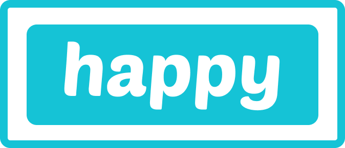
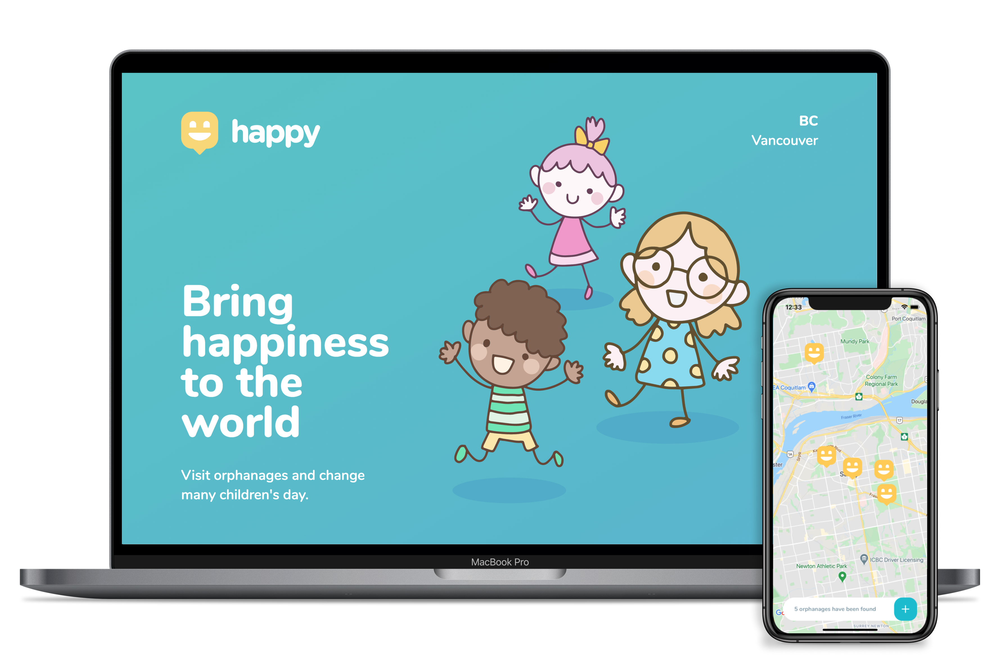
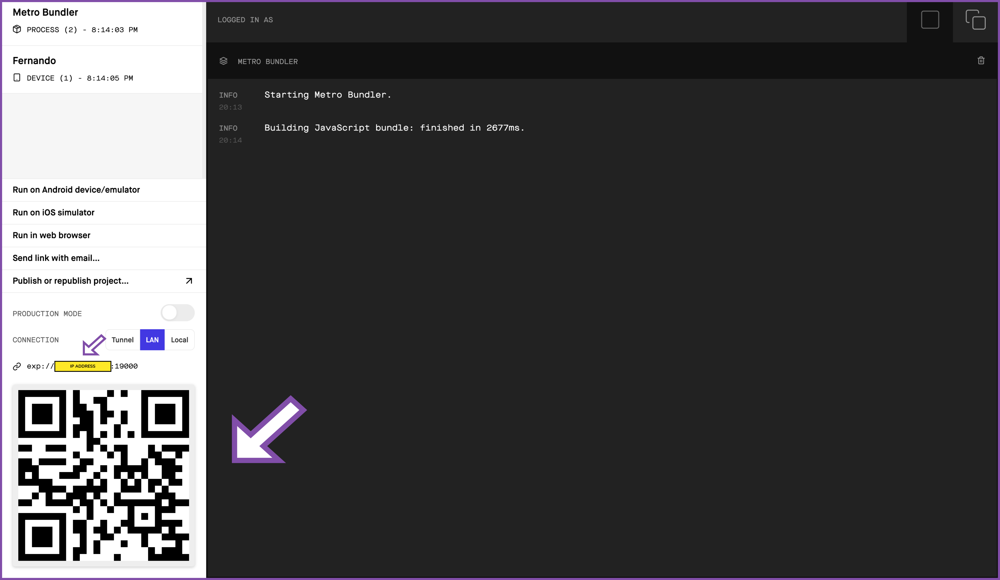
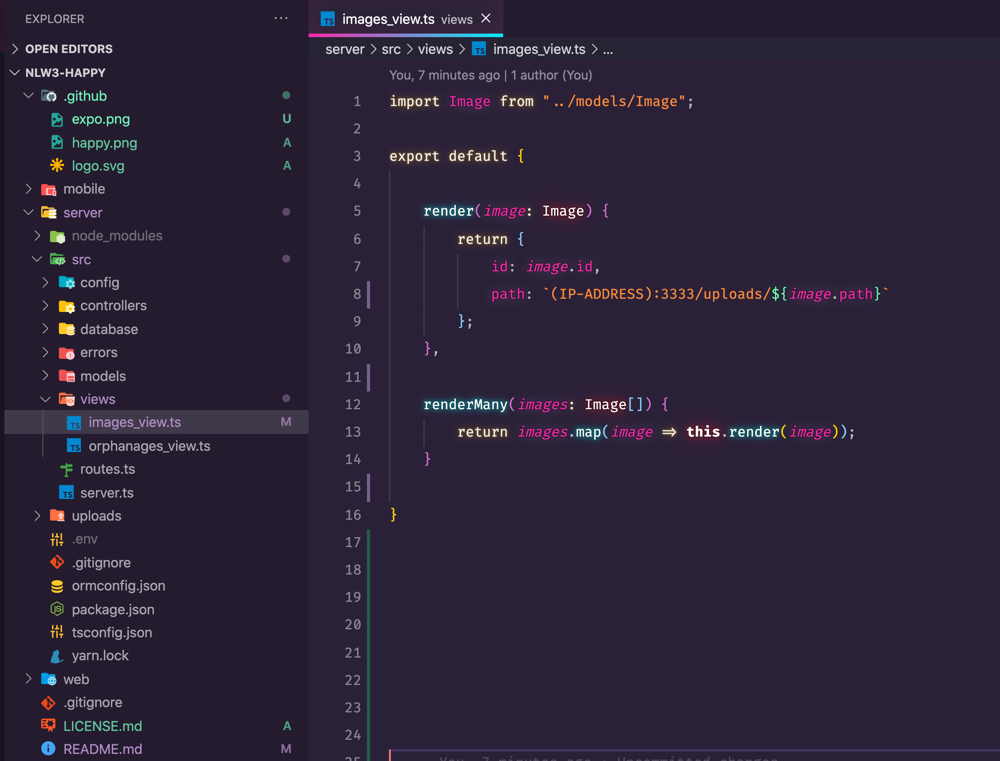

<h1 align="center">
    
</h1>

<p align="center">
  <a href="#-technology">Technologies</a>&nbsp;&nbsp;&nbsp;|&nbsp;&nbsp;&nbsp;
  <a href="#-project">Project</a>&nbsp;&nbsp;&nbsp;|&nbsp;&nbsp;&nbsp;
  <a href="#-layout">Layout</a>&nbsp;&nbsp;&nbsp;|&nbsp;&nbsp;&nbsp;
  <a href="#memo-license">License</a>
</p>

<p align="center">
 

  
</p>

<br>

<p align="center">
  
</p>

## 🚀 Technologies

This project was built with the technology below:


- [Node.js](https://nodejs.org/en/)
- [React](https://reactjs.org)
- [React Native](https://facebook.github.io/react-native/)
- [Expo](https://expo.io/)
- [TypeScript](https://www.typescriptlang.org/)

## 💻 Project
<br>

The Happy application was a project that #Rocketseat had proposed during #NLW3 event which had as objective to motivate people to connect with orphanages or institutes that have a responsibility the care for older people or who not have a shelter. 


# :information_source: How To Use
<br>

To clone and run this application, you'll need [Git](https://git-scm.com), [Node.js v10.16][nodejs] or higher + [Yarn v1.13][yarn] or higher installed on your computer and the [Happy API](https://github.com/Fernandosilvasc/nlw3-happy.git).From your command line:

# First step:
<br>

```bash
# Clone this repository
$ git clone https://github.com/Fernandosilvasc/nlw3-happy

# Go into the repository
$ cd nlw3-happy
```

# 📡 Backend 
<br>

```bash
# Install dependencies for the backend
$ cd server
$ yarn install

# Run migrations to your database
$ yarn migrate

# Run the backend server
$ yarn server
```

# 🖥 Frontend 
<br>

```bash

# Install dependencies for the frontend and run the server
$ cd web
$ yarn install
$ yarn start
```
# 📱 Mobile 
<br>

First install the Expo app in your phone.

```bash

# Install the Expo CLI 
$ yarn global and expo-cli

# Install dependencies for the mobile and run 
$ cd Mobile
$ yarn install
$ expo start or $ yarn start
```

After runner the application the expo is going to open the window as below:

<p align="center">
  
</p>

Then take the Ip address and go to ```bash nlw3-happy/server/src/views/images_view.ts``` replace as below:

<p align="center">
  
</p>


## 🔖 Layout
<br>

The links below you can access the layout of the project web and mobile. However, you need to have a [Figma](http://figma.com/) account to access.

- [Layout Web](https://www.figma.com/file/mDEbnoojksG4w8sOxmudh3/Happy-Web)
- [Layout Mobile](https://www.figma.com/file/X27FfVxAgy9f5IFa7ONlph/Happy-Mobile)


## :memo: License
<br>

This project is licensed under the MIT License - see the [LICENSE](LICENSE.md) file for more information.


👨🏻‍💻 - Made by Fernando Corrêa da Silva.
